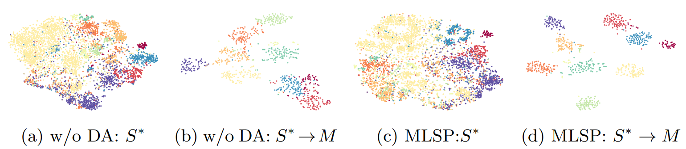

# Point Cloud Domain Adaptation via Masked Local 3D Structure Prediction

<p align="center"> 
    
</p> 
 
 ### Abstract
The superiority of deep learning based point cloud representations relies on large-scale labeled datasets, while the annotation of point clouds is notoriously expensive. One of the most effective solutions is to transfer the knowledge from existing labeled source data to unlabeled target data. However, domain bias typically hinders knowledge transfer and leads to accuracy degradation. In this paper, we propose a  Masked Local Structure Prediction (MLSP) method to encode target data. Along with the supervised learning on the source domain, our method enables models to embed source and target data in a shared feature space. Specifically, we predict masked local structure via estimating point cardinality, position and normal. Our design philosophies lie in: 1) Point cardinality reflects basic structures (eg. line, edge and plane) that are invariant to specific domains. 2) Predicting point positions in masked areas generalizes learned representations so that they are robust to incompletion-caused domain bias. 3) Point normal is generated by neighbors and thus robust to noisy points across domains. We conduct experiments on shape classification and semantic segmentation with different transfer permutations and the results demonstrate the effectiveness of our method.  

### Instructions
Clone repo and install it

cd MLSP
pip install -e .
```
you also need to install pintnet, knn-cuda and pointcloud lib pcl:
# PointNet++
pip install "git+git://github.com/erikwijmans/Pointnet2_PyTorch.git#egg=pointnet2_ops&subdirectory=pointnet2_ops_lib"
# GPU kNN
pip install --upgrade https://github.com/unlimblue/KNN_CUDA/releases/download/0.2/KNN_CUDA-0.2-py3-none-any.whl
# pcl
conda install -c sirokujira pcl --channel conda-forge
conda install -c sirokujira python-pcl --channel conda-forge

Download data:
```bash
cd ./xxx/data
python download.py
```
Where xxx is the dataset (either PointDA or PointSegDA)

To run the code of PointDA-10 experiments go to folder PointDA:
sh train.sh

<!-- ### Citation
Please cite this paper if you want to use it in your work,
```
@inproceedings{achituve2021self,
  title={Self-Supervised Learning for Domain Adaptation on Point Clouds},
  author={Achituve, Idan and Maron, Haggai and Chechik, Gal},
  booktitle={Proceedings of the IEEE/CVF Winter Conference on Applications of Computer Vision},
  pages={123--133},
  year={2021}
} -->
 ### Visulization of Cardinality
<p align="center"> 
    
</p>

 ### Visulization of Normal
<p align="center"> 
    
</p>

 ### PointSegDA dataset
<p align="center"> 
    
</p>

### PointDA dataset tsne
<p align="center"> 
    
</p> 
 

### Acknowledgement
Some of the code in this repoistory was taken (and modified according to needs) from the follwing sources:
[[PointNet]](https://github.com/charlesq34/pointnet), [[PointNet++]](https://github.com/charlesq34/pointnet2), [[DGCNN]](https://github.com/WangYueFt/dgcnn), [[PointDAN]](https://github.com/canqin001/PointDAN), [[Reconstructing_space]](http://papers.nips.cc/paper/9455-self-supervised-deep-learning-on-point-clouds-by-reconstructing-space), [[Mixup]](https://github.com/facebookresearch/mixup-cifar10), [[DefRec]](https://github.com/IdanAchituve/DefRec_and_PCM)